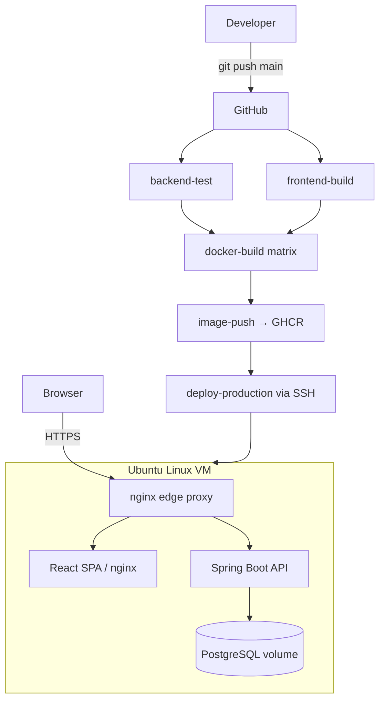

# Architecture

## System overview

```
                          ┌─────────────────────────────────────────────┐
                          │                GitHub                        │
                          │  push → Actions: test ▸ build ▸ push ▸ deploy │
                          └───────────────────┬─────────────────────────┘
                                              │ SSH (deploy key) + registry pull
                                              ▼
┌──────────────┐    :80/:443   ┌───────────────────────────────────────────────┐
│              │  ───────────▶ │             Ubuntu Linux VM                     │
│   Browser    │               │                                                 │
│  (operator)  │ ◀───────────  │  ┌─────────────┐                                │
└──────────────┘   SPA + JSON  │  │ nginx (edge)│  reverse proxy / TLS / rate    │
                                │  │  :80 / :443 │  limiting / security headers   │
                                │  └──────┬──────┘                                │
                                │         │                                       │
                                │   ┌─────┴───────┐         ┌──────────────────┐  │
                                │   │  frontend   │         │     backend      │  │
                                │   │  nginx +    │         │  Spring Boot 21  │  │
                                │   │  React SPA  │         │  REST + JWT      │  │
                                │   │   :80       │         │  Actuator :8080  │  │
                                │   └─────────────┘         └────────┬─────────┘  │
                                │                                    │            │
                                │                           ┌────────┴─────────┐  │
                                │                           │   PostgreSQL 16  │  │
                                │                           │  (named volume)  │  │
                                │                           └──────────────────┘  │
                                │   docker network: appnet (bridge)               │
                                └─────────────────────────────────────────────────┘
```

Mermaid version (renders on GitHub):



## Components

| Component | Tech | Responsibility |
|---|---|---|
| Frontend | React 18 + Vite, served by nginx | Operations console UI (auth, dashboard, pipeline view) |
| Backend | Java 21, Spring Boot 3.3, Spring Security | REST API, JWT auth, business + health endpoints |
| Database | PostgreSQL 16 | Persistent user store; schema managed by Flyway |
| Edge proxy | nginx 1.27 | Single entrypoint, routing, TLS termination, rate limiting, security headers |
| CI/CD | GitHub Actions | Test → build → containerize → push → deploy |
| Registry | GitHub Container Registry | Versioned, immutable image storage (`sha-<commit>`) |
| Runtime host | Ubuntu 22.04/24.04 VM | Docker Engine + Compose; AWS EC2 compatible |
| Observability | Actuator + Micrometer + Prometheus/Grafana | Metrics, health probes, dashboards |

## Request path

1. Browser hits the VM on port 80/443 → **edge nginx**.
2. nginx routes:
   - `/` → frontend container (static SPA, history fallback)
   - `/api/**` → backend container (rate-limited; `/api/auth` stricter)
   - `/actuator/health|info|prometheus` → backend (open); rest of actuator is
     restricted to the internal docker network.
3. Backend validates the JWT (stateless — no server sessions), serves JSON.
4. Backend talks to PostgreSQL over the private `appnet` bridge network.

## Why this shape

- **Stateless JWT** keeps the backend horizontally scalable and the demo simple.
- **Edge nginx as the only exposed port** shrinks the attack surface — the
  backend and database are never published to the host.
- **Immutable `sha-<commit>` image tags** make every deploy traceable and make
  rollback a one-variable change (`IMAGE_TAG`).
- **Health-gated deploy with rollback** means a bad build cannot take prod down.
- **Named DB volume** decouples data lifecycle from container lifecycle, so
  redeploys never risk the database.
